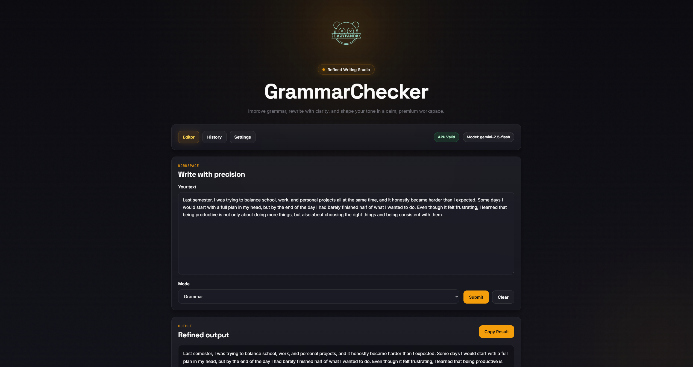
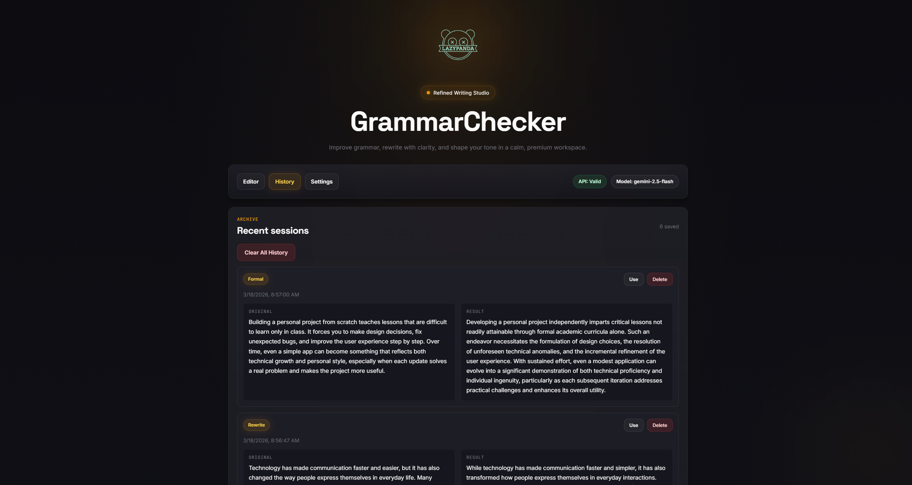
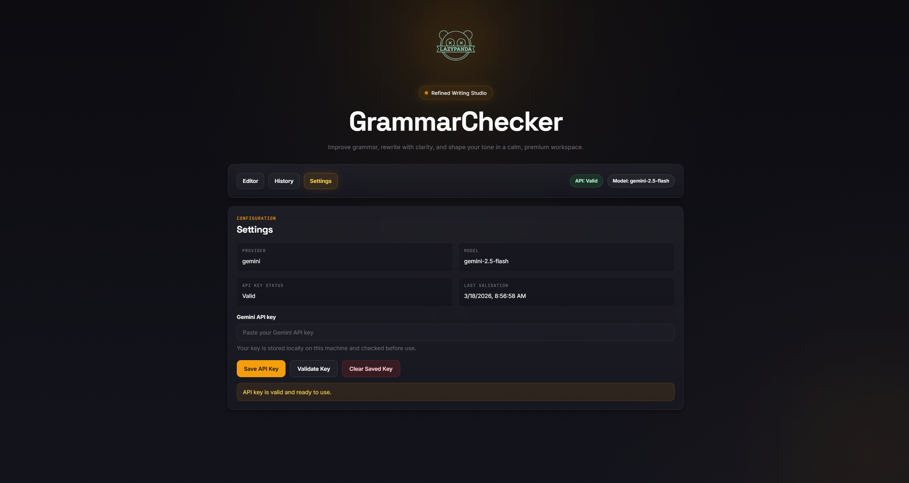

# GrammarChecker

GrammarChecker is a desktop grammar and rewriting app built with Electron, React, and the Google Gemini API.

It provides grammar correction, rewrites, tone changes, local API key setup, and persistent history in a clean desktop workspace.

## Download

Download the latest Windows installer from the [Releases](../../releases) page.

## Screenshots

### Editor


### History


### Settings


## Features

- Fix grammar, spelling, punctuation, and sentence structure
- Rewrite text more clearly while keeping the meaning
- Convert writing to a formal tone
- Convert writing to a casual tone
- Stream output gradually for a smoother writing experience
- Save the user's API key locally on their own machine
- Persist history across app launches
- Reopen, reuse, and delete past history items
- Keep user secrets out of the public repo

## Current App Flow

1. User opens the desktop app
2. User adds their own Gemini API key in Settings
3. The app stores the key locally on that machine
4. User submits text in one of the writing modes
5. The result streams into the interface with a paced reveal
6. Completed results are saved to local history
7. History remains available after closing and reopening the app

## Modes

- Grammar
- Rewrite
- Formal
- Casual

## Tech Stack

- Electron
- React
- Vite
- JavaScript
- Google Gemini API

## Project Structure


GrammarChecker/

├── backend/

├── build/

├── frontend/

├── screenshots/

├── .env.example

├── .gitignore

├── LICENSE

├── README.md

├── SECURITY.md

├── electron-store.js

├── main.js

├── package.json

└── preload.js

## Local API Key Behavior

GrammarChecker does not include a built-in API key.

Each user adds their own Gemini API key in the app settings. The key is stored locally on that user's machine and should never be committed to the repository.

## Getting Started

### 1. Clone the repository

```bash
git clone https://github.com/LazyPanda902/GrammarChecker.git
cd GrammarChecker
```

### 2. Install dependencies

```bash
npm install
cd frontend
npm install
cd ..
```

### 3. Run the desktop app

```bash
npm run desktop
```

### 4. Build the app

```bash
npm run pack
```

To create a distributable build instead:

```bash
npm run dist
```

## Security

- Do not hardcode real API keys into source files
- Do not commit a real `.env` file
- Do not commit any local settings or user data files
- Each user should enter their own API key in the app

If you discover a security issue, report it responsibly through the repository owner.

## Credits

This project used [Design Prompts](https://www.designprompts.dev/) as inspiration for design prompting and interface direction.

## License

This project is licensed under the MIT License.
